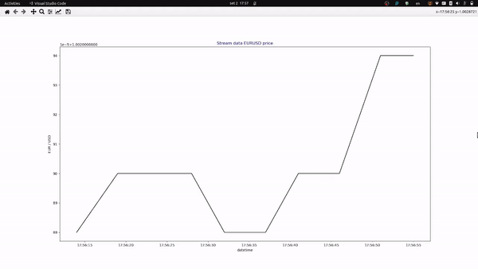

# Price Streamer with truefx.com

## Description
1. Get data from truefx.com and save it into .csv file with `get_datastream_truefx.py`
2. Read cvs file and update results for price live streaming  with `price_streamer.py`

## Installation
1. `python3 -m venv venv`
2. `source venv/bin/activate`
3. `python3 -m pip install requirements`

## How to run
1. `python3 get_datastream_truefx.py`
2. `python3 price_streamer.py`
